##  Tuto  reveal js

##### *Par* : Zakaria Azizi
##### *Encadre Par* : Mr Essarraj Fouad

|||

## Introduction :

|||

## 1 Apprentissage :
    
    - Reveal.js
    - Github Pages
    - Git SubModule
    - Jekyll
|||
 
## 2 Planification :

|||

## 3 Pkg-Creation-projets-mockup :

|||

## 4 Empathie :

|||

## 5 Définir :
|||

## 6 Idéer :
|||

## 7 Prototype :
|||

## 9 Test :
    

### Conclusion
