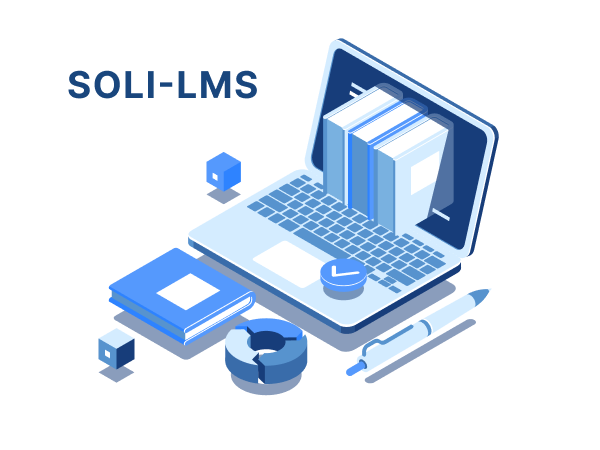
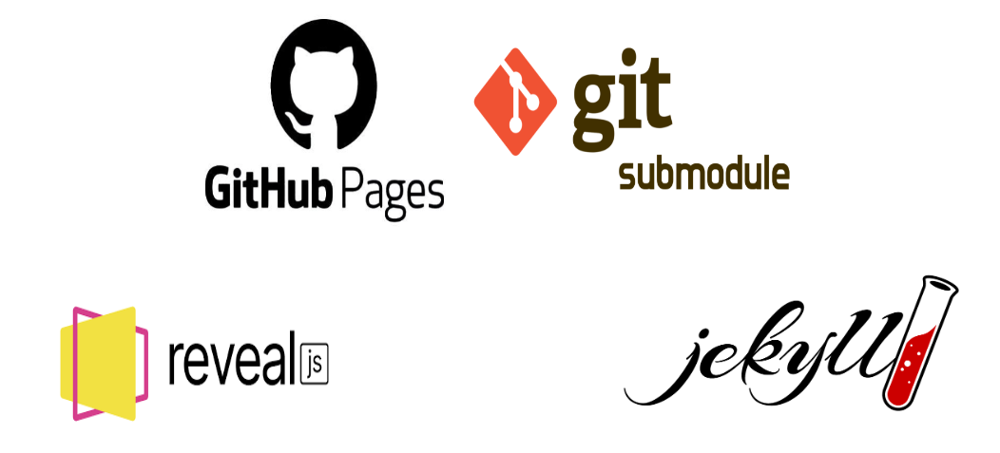
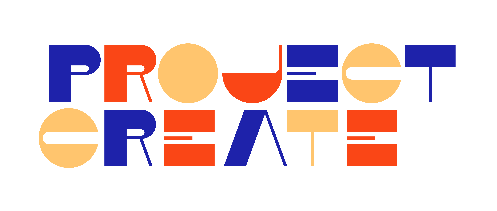

## Analyse & Conception

> _Soli-lms pkg-Creation-projet_

##### Présenté par : _Zakaria Azizi_

##### Encadre Par : _Mr Essarraj Fouad_

|||

## Introduction :

|||

> ### 1 Apprentissage :

|||

> ### 3 Pkg-Creation-projets-mockup :

|||

> ### 2 Planification :

<table style="font-size: 22px">
  <tr>
    <th></th>
    <th>1</th>
    <th>2</th>
    <th>3</th>
  </tr>
  <tr>
    <td>Lundi</td>
    <td>Branche technique - Tuto-1</td>
    <td>Branche technique - Tuto-2</td>
    <td>Branche technique - Tuto-3</td>
  </tr>
  <tr>
    <td>Mardi</td>
    <td>-</td>
    <td>-</td>
    <td>Branche fonctionnelle - Empathie/Définir</td>
  </tr>
  <tr>
    <td>Mercredi</td>
    <td>Branche fonctionnelle - Idéation/Diagramme de classes</td>
    <td>Branche fonctionnelle - Diagramme de classes</td>
    <td>Conception - Maquette</td>
  </tr>
  <tr>
    <td>Jeudi</td>
    <td>Conception - Maquette</td>
    <td>file-rouge</td>
    <td>Conception - Maquette</td>
  </tr>
  <tr>
    <td>Vendredi</td>
    <td>Test / Feedback</td>
    <td>Presentation</td>
    <td>file-rouge</td>
  </tr>
</table>

|||

> ### 4 Empathie :

  

|||

> ### 5 Définir :

|||

> ### 6 Idéer :

|||

> ### 7 Prototype :

|||
> ### 9 Test :

|||

## Conclusion
