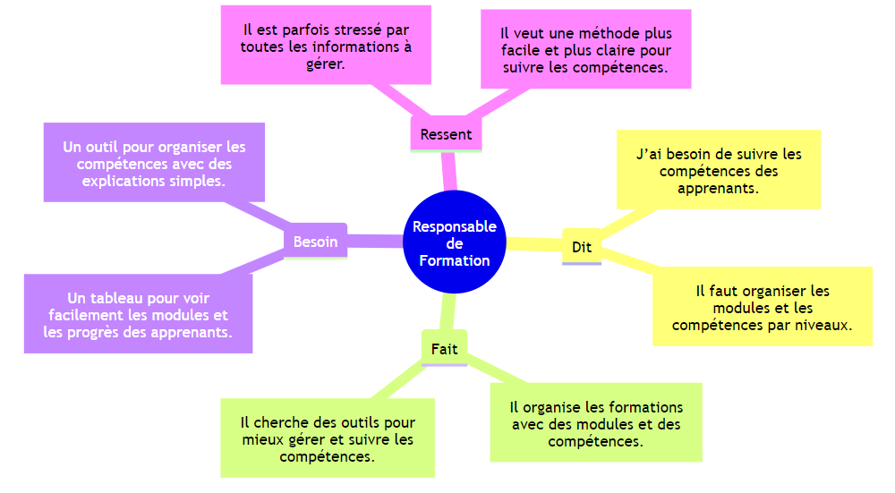
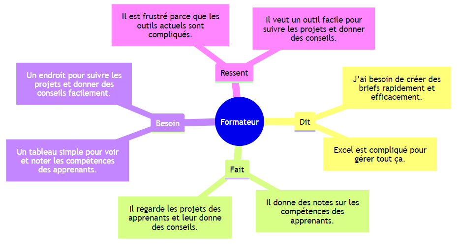
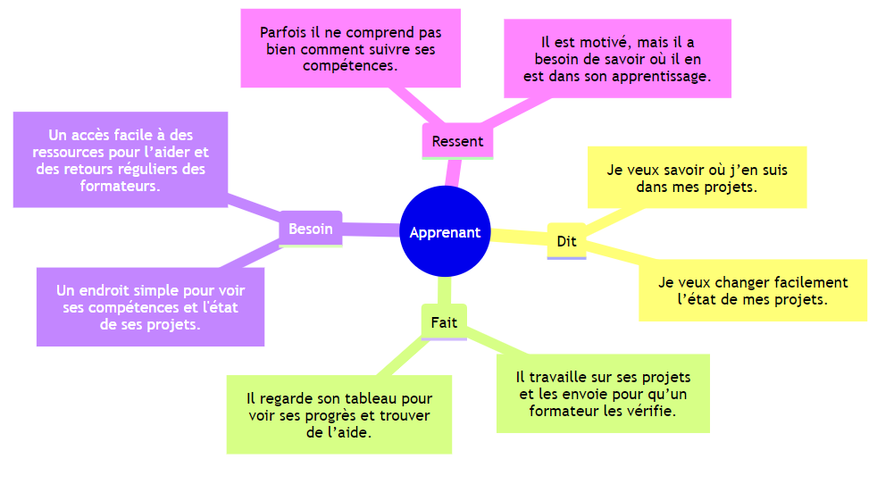
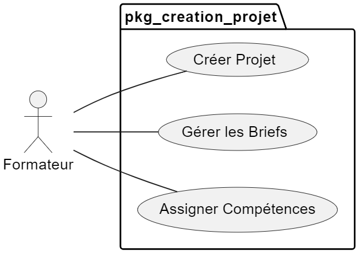

# 3 Design-Thinking :

> ## 1.1 Empathie `Responsible de Formation` :

  

### Responsable de Formation

#### Ce qu'il dit
- « J’ai besoin de suivre les compétences des apprenants. »
- « Il faut organiser les modules et les compétences par niveaux. »

#### Ce qu'il fait
- Il organise les formations avec des modules et des compétences.
- Il cherche des outils pour mieux gérer et suivre les compétences.

#### Ce qu'il ressent
- Il est parfois stressé par toutes les informations à gérer.
- Il veut une méthode plus facile et plus claire pour suivre les compétences.

#### Ce dont il a besoin
- Un tableau pour voir facilement les modules et les progrès des apprenants.
- Un outil pour organiser les compétences avec des explications simples.

> ## 1.2 Empathie `Formateur` :

  

### Formateur

#### Ce qu'il dit
- « Je veux suivre facilement les progrès des apprenants. »
- « Excel est compliqué pour gérer tout ça. »

#### Ce qu'il fait
- Il donne des notes sur les compétences des apprenants.
- Il regarde les projets des apprenants et leur donne des conseils.

#### Ce qu'il ressent
- Il est frustré parce que les outils actuels sont compliqués.
- Il veut un outil facile pour suivre les projets et donner des conseils.

#### Ce dont il a besoin
- Un tableau simple pour voir et noter les compétences des apprenants.
- Un endroit pour suivre les projets et donner des conseils facilement.

---

> ## 1.3 Empathie `Apprenant` :

  

### Apprenant

#### Ce qu'il dit
- « Je veux savoir où j’en suis dans mes projets. »
- « Je veux changer facilement l’état de mes projets. »

#### Ce qu'il fait
- Il travaille sur ses projets et les envoie pour qu’un formateur les vérifie.
- Il regarde son tableau pour voir ses progrès et trouver de l’aide.

#### Ce qu'il ressent
- Parfois il ne comprend pas bien comment suivre ses compétences.
- Il est motivé, mais il a besoin de savoir où il en est dans son apprentissage.

#### Ce dont il a besoin
- Un endroit simple pour voir ses compétences et l'état de ses projets.
- Un accès facile à des ressources pour l’aider et des retours réguliers des formateurs.

---

> ## 2 Définition Problématique  de `pkg-creation-Projet`:

#### Problématique : 
Les formateurs ont besoin d'un outil qui leur permette de créer facilement des briefs de projet, d'assigner des objectifs clairs et de suivre l'avancement des projets des apprenants.

> ## 3 Idéation :

- Création de Briefs : Permet de créer des briefs avec objectifs et critères.
- Modèles : Utiliser des modèles de briefs à personnaliser.
- Assignation : Assigner des projets avec des dates limites.
- Ressources : Ajouter des exemples et aides pour guider les apprenants.

### Fonctionnalités Principales

### Création de Projet

- Permet aux formateurs de créer un projet en définissant le titre, la description, la date de début, la date d'échéance et les compétences ciblées.
- Interface de création : Un formulaire simple avec des champs pour chaque attribut du projet.
- Possibilité d'ajouter des fichiers ou des ressources à associer au projet.

### Gestion des Briefs

- Chaque projet peut avoir un ou plusieurs briefs, qui détaillent les livrables attendus et les objectifs d’apprentissage associés.
- Modèle de Brief : Les formateurs peuvent créer des briefs standardisés avec des sections pour l'objectif, les tâches à accomplir, les critères de réussite, et des références pédagogiques.

### Suivi de l’État du Projet

- Un tableau de bord visuel permettant aux formateurs de suivre l’avancement des projets en temps réel.
- Statut du projet : Affiche des options telles que "En cours", "Complété", "En retard", avec la possibilité d’ajouter des commentaires sur le statut ou de solliciter des modifications.
- Suivi de livrables : Les formateurs peuvent marquer les livrables comme reçus, validés, ou à corriger.

### Attribution des Compétences

- Lors de la création d’un projet, les formateurs peuvent associer des compétences spécifiques que l’apprenant devra démontrer pour réussir.
- Association compétences-projet : Un menu déroulant ou une zone de recherche pour attribuer facilement des compétences prédéfinies aux projets.

> ## 4 Prototype :

> ## 5 Test :
